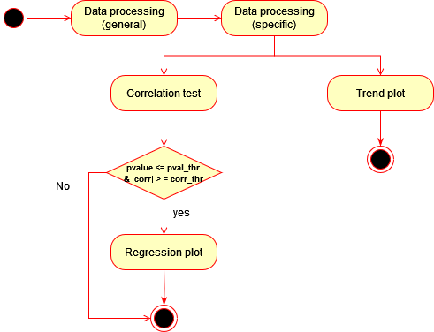

### Workflow 1: Exploring Statistical Similarities Between Categorical Variables based on COVID-19 Metrics

This workflow involves using the Mann-Whitney U test to identify statistical similarities between categorical variables based COVID-19 metrics like cases or deaths.
The used metric can be chosen with running this workflow with either 'new_cases' or 'new_deaths' as parameters. The categorical variables that are currently running in this workflow are adjustable with the parameters 'median_age', 'gdp_per_capita', 'life_expectancy' or 'population_density'.
Furthermore, this workflow needs a specific year (from 2020 to 2024) and a continent as input. All parameters can be adjusted in the respective configuration file. 

The workflow has 5 components, among which 2 are tailored to the covid-19 dataset (components 1 and 2). 
### Uml activity diagram

### Explanation
1. Perform a general processing of the covid-19 dataset, in particular create new time columns: year, semester and month.
2. Process the data to create a dataset with relevant categorical variables (e.g., GDP per capita, life expectancy, etc.) and COVID-19 metrics.
3. Apply the Mann-Whitney U test to each categorical variable, comparing the COVID-19 metric values between the different categories.
4. Box plot: For categorical variables with p-values below 0.05, create box plots to visualize the statistic similarity in the COVID-19 metric between the two groups.
5. Line plot: For categorical variables with p-values above 0.05, create line plots to visualize the trend in the chosen COVID-19 metric over time. This shows the statistically significant difference between the two groups. 

## Component analysis

| Abstract Workflow Node     | Input(s)                                                                      | Output(s)  | Implementation     |
|----------------------------|-------------------------------------------------------------------------------|------------|--------------------|
| data processing            | csv file name, outfile name                                                   | .csv file  | own implementation |
| data processing workflow 1 | csv file name, outfile name, time period (month or semseter), continent, year | .csv file  | own implementation |
| mann whitney u test        | csv file name, outfile name, categorical variable, y                          | .txt file  | own implementation |
| box plot                   | csv file, x, y, outfile name                                                  | .png file  | own implementation |
| line plot                  | csv file name, x, y, outfile name                                             | .png file  | own implementation |

