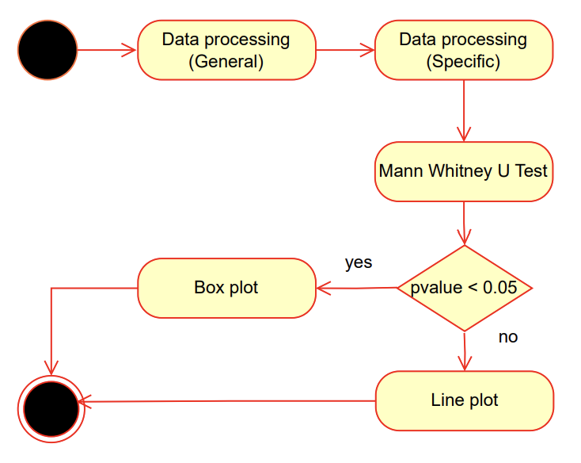

### Workflow 1: Exploring influence of life expectancy, median age, GDP per capita and population density on COVID-19 metrics 

Restricting to a given year and continent, this workflow involves using the Mann-Whitney U test to identify a difference in mean of chosen covid-19 metrics within countries with the factor of interest (life expectancy, median age, ecc..) above the median and below the median. The median is computed w.r.t the continent.

The used metric can be chosen when running this workflow as either 'new_cases' or 'new_deaths' as parameters. The categorical variables that are currently running in this workflow are 'median_age', 'gdp_per_capita', 'life_expectancy' and 'population_density'.
Furthermore, this workflow needs a specific year (from 2020 to 2024) and a continent as input. All parameters can be adjusted in the respective configuration file. 
It has 5 components, among which 2 are tailored to the covid-19 dataset (components 1 and 2). 
### Uml activity diagram

### Explanation
1. Perform a general processing of the covid-19 dataset, in particular create new time columns: year, semester and month.
2. Filter by chosen continent and year (Y). Then the data is aggregated by month (MM-Y), and only outcomes of interest (new deaths and cases) are kept. Then, starting from the original columns GDP per capita, life expectancy, median age and population density, containing numerical values, they are processed (index is continent-location-month) to create binary categorical variables with value 1 when orginal value is above the median (w.r.t continent) and 0 else.

For each categorical variable and both outcomes new deaths and new cases:

3. Apply the Mann-Whitney U test to see whether there is a difference in mean of the outcome in the two groups identified by the binary categorical variable created at specific proccesing time.
4. Box plot: if component 3 outputs p-value below 0.05, create box plots to visualize the difference in mean, that is then statistically significant, of the outcome in  the two groups.
5. Line plot: if component 3 outputs p-value above 0.05, create line plots to visualize the trend of the outcomes in the two groups against month (MM-Y).

## Component analysis

| Abstract Workflow Node     | Input(s)                                                                      | Output(s)  | Implementation     |
|----------------------------|-------------------------------------------------------------------------------|------------|--------------------|
| data processing            | csv file name, outfile name                                                   | .csv file  | own implementation |
| data processing workflow 1 | csv file name, outfile name, continent, year | .csv file  | own implementation |
| mann whitney u test        | csv file name, outfile name, categorical variable, y                          | .txt file  | own implementation |
| box plot                   | csv file, x, y, outfile name                                                  | .png file  | own implementation |
| line plot                  | csv file name, x, y, outfile name                                             | .png file  | own implementation |

