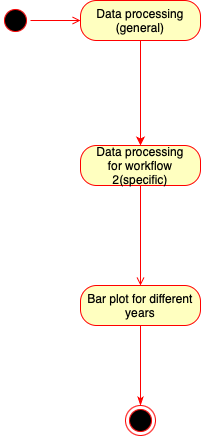

# Workflow 2: Exploring total deaths and cases by continent on a yearly level.
The results that can be derived by this workflow allow to get an overview of how the total number of deaths or cases (w.r.t a fixed year) differed by continents. The workflow has 3 components, which are all tailored to the covid-19 dataset. 

### Uml activity diagram

### Explanation
1. Perform a general processing of the covid-19 dataset, in particular create new time columns: year, semster, month.
2. Process the data to create a dataset with relevant variables (total_cases,total_deaths) for research question 2 aggregated  by month (MM-YY) (original data is at daily level). The outcomes, total deaths and cases, can be optionally normalized by the population of the continent.
3. Create a bar plot of total_cases or total_deaths for each continent over a chosen year between 2020 to 2023.

## Component analysis

| Abstract Workflow Node                  | Input(s)     | Output(s)                 | Implementation     |
|-----------------------------------------|--------------|---------------------------|--------------------|
| data processing            | csv file name, outfile name | .csv file         | own implementation  |
| data processing workflow 2    | csv file name, outfile name, normalize_by_pop (True or False)  | .csv file   | own implementation |
| bar plot                   | csv file name, outfile name, outcome (total_cases or total_deaths), year  | .png  file | own implementation |

