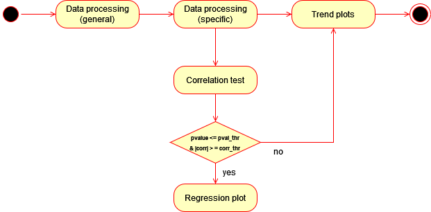

# Workflow 3: exploring relationship between deaths, cases and vaccinations for Covid-19.
The results that can be derived by this workflow allow to get an overview of the relationship between number of new cases, deaths and vaccinations by month or semester. The analysis can be
performed either considering whole Euorpe or the specific case of Germany. The workflow has 5 components, among which the processing components (1 and 2) are tailored to the covid-19 dataset, while the remaining 3 are resuable with other datasets.
## Abstract workflow
### Uml activity diagram

### Explanation
1. Perform a general processing of the covid-19 dataset, in particular create new time columns: year, semster, month.
2. Perform a specific processing of output of component 1 for the research aim of this workflow: aggregate data by either month or semester, filter by continent == Europe or by location == Germany, and create a new outcome, "deaths_over_cases", storing the ratio between new number of deaths and new number of cases w.r.t the chosen time period (month/semester).
3. Correlation test: the component performs a spearman hypothesis test for two columns of choice of a given dataset. In our case this component is run with the dataset output of component 2 and variables: "new vaccinations" and "deaths_over_cases".
4. Regression plot: the component produces a regression plot (including scatter plot) for x and y, columns of a given dataset. We will run this component with the variables fed to component 3 **only if** the results of the correlation test are significant w.r.t provided thresholds for pvalue and absolute value of the correlation.
5. Trend plot: the component produces a trend plot comparing two y variables against a common x variable. All the variables are columns of a given dataset. We will run this component 3 times producing trend plots comparing "new deaths"-"new cases", "new deaths"-"new vaccinations", and "deaths_over_cases"-"new_vaccinations". The x variable will be either month or semester. 

## Component analysis

| Abstract Workflow Node                  | Input(s)     | Output(s)                 | Implementation     |
|-----------------------------------------|--------------|---------------------------|--------------------|
| data processing            | csv file name, outfile name | .csv file         | own implementation  |
| data processing workflow 3                 | csv file name, outfile name, time period (month or semseter), germany (True or False)  | .csv file   | own implementation |
| correlation test                         | csv file name, outfile name, var1, var2,  pvalue and correlation abs thresholds     | .txt files (x2) with results and results significance     | own implementation |
| regression plot                   | csv file name, outfile name, x, y    | .png  file | own implementation |
| trend plot                    | csv file name, outfile name, y1, y2,  x     | .png file            | own implementation |

